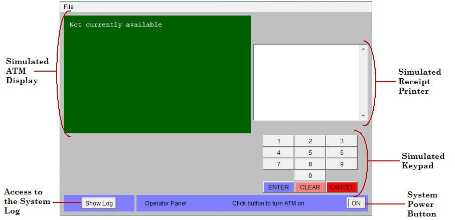

# Testing and Defect Tracking

This project involved an exploration of different testing techniques, applied to an ATM simulation developed by [Russell C. Bjork of Gordon College](https://www.math-cs.gordon.edu/courses/cs211/ATMExample/Links.html).

High Level Requirements can be found [here](https://www.math-cs.gordon.edu/courses/cs211/ATMExample/Requirements.html).

SUT Use Cases can be found in [Appendix A](#appendix-a-sut-use-cases).

In this project, we performed three different types of testing: exploratory testing, manual scripted testing, and regression testing on this system. We began by conducting exploratory tests in two independent groups, before moving onto manual scripted testing and finally regression testing.

Before this project, we knew that exploratory testing involves designing and executing tests at the same time, creatively considering different aspects and edge cases and then executing on those testing ideas. On the other hand, manual scripted testing involves first designing tests in a single stage, and executing these tests at a later date. Finally, we understood beforehand that regression testing was a form of testing designed to compare changes between different versions of software, that is, after an update has been released to ensure that new code changes and bug fixes do not negatively impact existing functionality. We learned in lecture that test cases should be re-run when software gets updated to ensure there are not any unintended consequences from our code releases.

# System Under Test

The system under test for this lab is an ATM simulation system. To get started with this system, we downloaded the simulation files. There are two versions of the ATM system which represent two consecutive releases of the software with bugs and bug fixes:

-   ATM System - Lab 1 Version 1.0
-   ATM System - Lab 1 Version 1.1

1.  **Purpose of the System**

This system was originally developed in an American college (called Gordon College) in order to demonstrate an entire iteration of an object-oriented software development methodology. The entire project is available open-source online, see reference [1] for the URL. The purpose of the system is to allow the user to deposit, withdraw, query and transfer funds to/from his/her hypothetical
bank account(s).

2.  **Usage of the System**

    To use the ATM simulation system, run JAR file _ATM System – Lab 1 Version 1.0.jar_. The system should begin execution with the GUI.

    

    There are two valid hard-coded card numbers and PINs:

    -   Card Number: 1 PIN: 42 Available Accounts: Checking and Savings

    -   Card Number: 2 PIN: 1234 Available Accounts: Checking and Money Market Note:

    Both of these cards access the same checking account.

    The initial balances are: Checking: \$100 Savings: \$1,000 Money Market: \$5,000

# High-level description of the exploratory testing plan

For the exploratory testing phase, we first thoroughly read the system requirements and drafted a shortlist of features to test. In our shortlist, we included the following features to be tested:

-   Test that the customer must include a valid ATM card and valid PIN, to be verified by the bank
-   Ensure customer can perform more than one transaction
-   Ensure customer can withdrawal from any suitable account in multiples of $20
-   Ensure a customer can transfer between accounts
-   Ensure customer can abort a transaction
-   Ensure customer can make a balance inquiry to any account linked
-   Ensure a failed transaction is handled correctly - customer can time out envelope OR press cancel
-   Ensure the card will be permanently retained after 3 invalid PIN entries
-   Ensure failure of a transaction displays message and prompts user for another transaction
-   Ensure printed receipt is valid
    -   Successful transaction
    -   Date
    -   Time
    -   Machine location
    -   Type of transaction
    -   Accounts
    -   Amount
    -   Ending and available balance
-   Ensure servicing is valid - on and off switch
-   Ensure logging transactions works

From this list, we executed tests for each function and tried various edge cases and regular use cases to extensively test each feature. We documented any bugs we found in our pairs and convened as a group to evaluate the system’s bugs. We performed the extensive exploratory testing phases separately as groups

# Scope of Testing

## Functions To Be Tested

All the features of the ATM as defined in the High Level Requirements are to be tested:

-   System Startup
-   System Shutdown
-   Session
-   Transaction
-   Withdrawal
-   Deposit
-   Transfer
-   Inquiry
-   Invalid PIN extension

## Functions Not Tested

These feature are not be tested because they are not included in the High Level Requirements:

-   Performance testing (response time, periods of high usage)
-   Usability testing (user interface ease of use)
-   Reliability testing
-   Security Testing

## Test Types

1. **Manual Exploratory Testing:** This involves exploring the software without predefined test cases, allowing the tester to learn the application, identify defects, and understand user workflows.
1. **Manual Scripted Testing:** This involves executing predefined test cases based on specifications, user requirements, or other documentation. This is more structured than exploratory testing.
1. **Regression Testing:** This type of testing is conducted to ensure that new changes or updates to the software do not negatively impact existing functionalities. This involves re-running both exploratory and scripted tests to verify that the system still behaves as expected.

For exploratory unscripted testing, all team members participated in exploration. We employed pair testing and then discussed and compared bugs that had been found and unique bugs were entered into an issue tracking system (Azure).

Note: some of the bugs were found initially in the exploratory testing phase. We tested each feature explicitly with manual scripted testing, but the users ‘assigned to’ each bug in Azure may not align with the manual scripted testing list as defined below.

# Comparison of Exploratory and Manual Functional Testing (MFT)

Our exploratory testing involved interpreting the system requirements and devising test scenarios to validate these requirements. This process required a thorough understanding of the system's functionalities and some creativity to explore various testing scenarios. Collaborative exploratory testing proved to be effective in uncovering most of the bugs, especially in a small system with clear requirements. However, our documentation for this approach was less formal and organized, resembling quick notes rather than a structured testing plan. Despite this, exploratory testing provided us with the flexibility to explore the system in diverse ways, making it a valuable testing method for this system. Nonetheless, we acknowledge that rigorous manual testing could yield similar results.

On the contrary, manual testing did not require much creativity, as we followed predefined test cases to navigate through the system. This task could be performed by anyone without specialized skills. However, manual testing instilled more confidence in the system's integrity, as it compelled us to test a comprehensive list of features, some of which we might not have considered during the exploratory stage. The explicit, numbered test cases ensured better documentation and coverage of various features. While this approach did uncover many of the same bugs as the exploratory stage, it also revealed new ones that were not previously considered. The method was effective in finding bugs and ensuring that each requirement was explicitly tested, but it also led to some redundant tests. Additionally, there were some blind spots where manual scripted testing failed to uncover certain bugs in the system.

# Notes and discussion of the peer reviews of defect reports

Reviewing other peers’ defect reports proved easier than expected due to the explicit documentation provided regarding system state, execution, and expected vs actual results. However, at times it was difficult to interpret the reports as we were getting used to the formatting requirements, and which information to include in the various sections. We suspect that with more practice and iterations on different projects, that we would have developed our own framework for bug reporting, as we have become more comfortable navigating ADO and its features.

One thing we would like to improve in future iterations is a consistent naming style, as to be able to quickly identify duplicate bugs at a glance. At times, our explanations of certain bugs seemed similar even if the bugs themselves were different. More care and attention at the bug-naming stage should be considered to provide quick navigation at-a-glance for all group members.

# How the pair testing was managed and team work/effort was divided

We divided the exploratory testing into groups of 2 and 3 and tested the program freely for 30 minutes.

We tested in a logical use fashion. System startup followed by card and PIN input, followed by checking account balances before attempting withdrawal. After the exploratory testing phase, we compared as a group our findings for version 1.0 and entered our bugs into Azure.

We divided the scripted test cases into segments of 8 test cases. Each team member was responsible for testing the 8 cases in version 1.0 and version 1.1. Any new bugs found were entered into Azure by the person who found them.

We kept track of the performance of the scripted test case both if they passed or if they resulted in a bug. Following the conclusion of the regression testing on the scripted test cases, we randomly went back to determine if the remaining bugs found were resolved in the new SUT.

# Challenges Encountered

## Unclear System Functionality:

-   **Example 1**: The select account screen displays all three account types, even if the card doesn’t have access to one of the account types. It is unclear if this is a bug or intended behavior.
    

-   **Example 2**: In version 1.0, the available balance following a deposit was not updated to match the deposited amount. It is unclear if this is a bug or intended behavior. Additionally, it raises questions about whether the bank holds deposit amounts for a period of time before allowing full access to the deposited amounts.
    

## Challenges in Exploratory Testing:

-   During exploratory testing, it was challenging to separate multiple bugs in one operation and identify the specific issues to document them concisely in the defect report.
    

In each case, we thoroughly documented our findings and worked collaboratively to address these challenges effectively.

## Challenges Overcome

During our testing process, we faced several challenges, all of which we successfully addressed through effective planning and teamwork.

1. **Identification and Documentation of Bugs**: One of the key challenges was accurately identifying and documenting bugs, especially during exploratory testing. To address this, we developed a standardized bug-reporting template and organized group discussions to ensure everyone understood how to use it effectively. This approach streamlined our bug reporting process, ensuring that all issues were documented accurately.

2. **Interpreting Ambiguous Requirements**: Some system requirements were ambiguous, leading to initial confusion. To overcome this challenge, we conducted internal brainstorming sessions to clarify our understanding of these requirements. This proactive approach helped prevent misunderstandings and ensured that our testing efforts were aligned with the project's objectives.

# Key Learnings:

-   Conducting thorough manual bug testing can be time-consuming.
-   Maintaining focus during exploratory bug testing is crucial to ensure accurate results.
-   Clear and detailed system requirements are essential for effective testing.
-   Testing a single workflow can unveil multiple test cases, highlighting the complexity of the system.
-   Documenting bug reproduction steps is vital for successful bug replication in exploratory testing.
-   While exploratory testing is valuable, it may not uncover all bugs due to its nature. Comparing pair testing defect reports revealed both overlap and discrepancies in findings.
-   Adopting a systematic approach to bug tracking, aligned with the project requirements, is vital. Using an issue tracking system enhances bug prioritization and resolution efficiency.

 

# Defect Report

Notes about our defect report:

-   Used Azure as our issue tracking system.
-   Marked severity of the bugs but not priority.
-   Used iteration to log when the bug was first found and labeled MFT if the bug was found
    in the manual functional testing as indicated in the assignment instructions.
-   Azure exported CSV is summarized below
-   Bugs are listed in order found in the SUT Test cases followed by the bugs found by
    exploratory testing.
-   Bugs are named first with the number found in the scripted test cases.

## Bug - Use Case #22 Wrong account balance after deposit - Active

Function Being Tested: Wrong account balance after deposit

Initial State: System is asking customer which account to deposit to

Steps to Reproduce:

1. Turn system on
1. Insert card: #1
1. Enter password: 42
1. Press 2 for deposit
1. Press 1 for checking
1. Enter: 100

Expected Outcome: TOTAL BAL: $200.00 shown in receipt

Actual Outcome: TOTAL BAL: $190.00 shown in receipt

SUT Version 1.0

Defect still exists in Version 1.1

Actual Outcome: TOTAL BAL: $190.90 shown in receipt

System Info:

-   SUT Version 1.0
-   SUT Version 1.1

\Exploratory Testing \Deposit

## Bug - Use Case #37 Correct PIN not immediately accepted after invalid PIN - Active

Function being tested: Correct re-entry of PIN is accepted after the first entry of incorrect pin

Initial State of the System: Request to re-enter PIN is being displayed

Steps to Reproduce:

1. Turn System ON
1. Enter '100' for quantity of $20 bills
1. Click "Insert Card"
1. Enter "1" for card number
1. Enter invalid PIN number (eg 69)
1. Enter valid PIN number (eg 42)

Expected Outcome:
After step 6, the system should accept the valid PIN and immediately allow the user into the account.

Actual Outcome:
System accepts PIN (does not count against users card), but does not allow user into system. User must re-enter a valid pin to enter the system.

System Info:

-   SUT Version 1.0
-   Defect still exists in Version 1.1

\Regression Testing \Invalid Pin

## Bug - Use Case #14 Withdrawal $20 returns $40 - Resolved

Function being tested: User withdrawal $20

Initial state of the system: System is displaying menu of withdrawal amounts

Steps to reproduce the defect:

-   Login to Card 1 with PIN 42
-   Select (2) Withdrawal
-   Select (1) withdrawal $20

Expected outcome:

-   User withdrawals $20
-   Receipt prints with $20 withdrawal from account

Actual outcome:

-   $40 displays on screen
-   $40 withdrawal from user account

System info:

-   SUT Version 1.0
-   Resolved in Version 1.1

\Exploratory Testing \Withdrawal

## Bug - Use Case #29 Balance transfer from savings to chequings - Resolved

Function being tested: Transfer amount from savings to chequings account

Initial State: System transfer from Savings to Chequings

Steps to reproduce:

1. Login to Card 1 with PIN 42
1. Select (3) transfer
1. Select (2) savings
1. Select (1) chequings
1. Enter amount
1. Expected outcome:
1. Entered amount gets transferred fully from savings account to chequings account

Actual outcome:
The actual amount, less 50 cents, gets transferred to the chequings account. If 50 cents is entered, then $0.00 gets transferred. If a value <$0.50 gets transferred, then a negative value gets transferred.

System Info:

-   SUT Version 1.0

\Exploratory Testing \Transfer

## Bug - Savings Account Display - Active

Function being tested: User viewing savings account

Initial state of the system: System is in inquiry

Steps to reproduce:

1. Login to card 1 with PIN 42
1. Select (4) account inquiry

Expected Outcome:
Option (2) displays user's savings account

Actual outcome:
Option (2) display money market

System Info:

-   SUT Version 1.0
-   Defect still exists in Version 1.1

\Exploratory Testing \Inquiry

## Bug - Inquiry to money market account not working - Resolved

Function being tested: User inquiry to money market account

Initial state of the system: System is displaying inquiry into user accounts

Steps:

1. Inset card 2 and enter PIN 1234
1. Select option (4) balance inquiry
1. Select (2) Money Market

Expected outcome:

System displays user's money market balance

Actual outcome:
Invalid account type displayed, system asks for another transaction

System Info:

-   SUT Version 1.0
-   Resolved in Version 1.1

\Exploratory Testing \Inquiry

## Bug - Use Case #33 Account #1 has wrong accounts for balance inquiry - Active

Function Being Tested: Wrong account types displayed for balance inquiry for #1 account

Initial State: System is asking customer to choose transaction type

Steps to Reproduce:

1. Turn system on
1. Insert card: #1
1. Enter password: 42
1. Press 4 for Balance Inquiry

_SUT Version 1.0_

Expected Outcome:

    1. Checking
    2. Savings

Actual Outcome:

    1. Checking
    2. Money Market

_SUT Version 1.1_

Expected Outcome:

    1. Checking
    2. Savings

Actual Outcome:

    1. Checking
    2. Savings
    3. Money Market

System Info:

-   SUT Version 1.0
-   Defect still exists in Version 1.1

\Regression Testing \Inquiry

## Bug - Use Case #29 Incorrect account type displayed in transfer - Active

Function being tested: Receipt displaying correct transfer information

Initial state of the system: System has completed a transfer from money market to checkings

Steps to reproduce:

1. Login to Card 2 with PIN 1234
1. Select (3) transfer
1. Select (3) money market
1. Select (1) chequing
1. Enter $100.00

Expected outcome: Receipt displays "TRANSFER FROM: MMKT TO: CHKG

Actual outcome: Receipt displays "TRANSFER FROM: CHKG TO: MMKT

System Info:

1. SUT Version 1.0
1. Resolved in Version 1.1

\Exploratory Testing \Inquiry

## Bug - Use Case #16 Withdrawal $200 from account with balance $100 returns $20 - Resolved

Function Being Tested: Withdrawal amount greater than account balance

Initial State: System is requesting a withdrawal amount. Checking account has $100 balance.

Steps to Reproduce:

1. Select withdraw transaction type
1. Select $200 withdrawal amount

Expected Outcome: Insufficient Funds

Actual Outcome:

    WITHDRAWAL FROM: CHKG

    AMOUNT: $20.00
    TOTAL BAL: $80.00
    AVAILABLE: $80.00

System Info:

1. SUT Version 1.0
1. Resolved in Version 1.1

\Manual Script Testing \Withdrawal

## Bug - Use Case #15 Withdraw exact amount in ATM - Resolved

Function Being Tested: System verifies that it has sufficient cash on hand to fulfill the request

Initial State: System has been started up with less than the maximum withdrawal amount in cash on hand; System is requesting a withdrawal amount.

Steps to Reproduce:

1. Set up ATM with only 1, $20 bill
1. Initiate 1) withdraw transaction
1. Select 1) checking account
1. Select 1) $20

Expected Outcome: Able to withdraw $20

Actual Outcome: Insufficient Funds message

System Info:

-   SUT Version 1.0
-   Resolved in Version 1.1

\Manual Script Testing \Withdrawal

## Bug - Use Case #18 $60 withdrawal dollar sign missing - Active

Function being tested: Withdrawal

Initial state of the system: System is displaying menu of dollar amounts

Steps to Reproduce:

1. Login to Card 1 with PIN 42
1. Press (2) Withdrawal
1. Press (1) Checking

Expected Outcome:
Option (3) should display '$60'

Actual Outcome:
Option (3) displays '60'

System Info:

-   SUT Version 1.1

\Manual Script Testing \Inquiry

## Bug - Use Case #26 Wrong account type to transfer from - Active

Function being tested: System asks customer to choose an account to transfer from

Initial state of the system: Menu of transaction from types is being displayed

Steps to reproduce:

1. Login to Card 1 with PIN 42
1. Select (3) transfer

Expected Outcome:

    1. Checking
    2. Savings

Actual Outcome:

    1. Checking
    2. Savings
    3. Money Market

System Info:

-   SUT Version 1.0
-   SUT Version 1.1

\Manual Script Testing \Transfer

## Bug - Use Case #27 Wrong account type to transfer to - Active

Function being tested: System asks customer to choose an account to transfer to

Initial state of the system: Menu of transaction to types is being displayed

Steps to reproduce:

-   Login to Card 1 with PIN 42
-   Select (3) transfer
-   Select an account to transfer from

Expected Outcome:

    1. Checking
    2. Savings

Actual Outcome:

    1. Checking
    2. Savings
    3. Money Market

System Info:

-   SUT Version 1.0
-   SUT Version 1.1

\Manual Script Testing \Transfer

## Bug - Use Case #29 System performs a transfer with wrong amount - Active

Function being tested: System performs a legitimate transfer

Initial state of the system:
System is displaying a request for the customer to type a dollar amount

Steps to reproduce:

-   Login to Card 1 with PIN 42
-   Select (3) transfer
-   Select (2) savings
-   Select (1) checking
-   Enter 10.00

Expected Outcome:
Receipt Displays: AMOUNT: $10.00 TOTAL BAL: $110.00

Actual Outcome:
Receipt Displays: AMOUNT: $9.50 TOTAL BAL: $109.50

System Info:

-   SUT Version 1.0
-   SUT Version 1.1

\Manual Script Testing \Transfer

## Bug - Total Balance and Available don't match - New

Function Being Tested: Balance Inquiry updates after deposits made

Initial State: System is requesting balance Inquiry after a deposit has been made

Steps to Reproduce:

1. Login for Card "1" with pin "42"
2. Enter "2" for Deposit
3. Enter "2" for Saving account
4. Enter $20 for amount to deposit and insert envelope
5. "1" for another transaction
6. "4" for balance inquiry
7. "2" for Saving

Expected Outcome:

    Total Bal: $1020 AVAILABLE: $1020

Actual Outcome:

    Total Bal: $1019.9 AVAILABLE: $1000

System Info:

-   SUT Version 1.1

\Regression Testing \Inquiry

## Bug - Use Case #35 Typo - "Wood/Would" in the display message after pressing cancel - Resolved

Function Being Tested: An inquiry transaction can be cancelled by the customer any time prior to choosing an account

Initial State: System is displaying menu of account types

Steps to Reproduce:

-   Turn system on
-   Insert card: #1
-   Enter password: 42
-   Press 4 for Balance Inquiry
-   Press cancel

Expected Outcome:

    Last transaction was cancelled. Would you like to do another transaction?

Actual Outcome:

    Last transaction was cancelled. Wood you like to do another transaction?

System Info:

-   SUT Version 1.0
-   Resolved in Version 1.1

\Regression Testing \Inquiry

## Bug - Use Case #39 Correct pin is needed twice in the second try - Active

Function Being Tested: Correct re-entry of PIN on the second try is accepted

Initial State: Request to re-enter PIN is being displayed

Steps to Reproduce:

-   Turn System ON
-   Enter '100' for quantity of $20 bills
-   Click "Insert Card"
-   Enter "1" for card number
-   Enter invalid PIN number (eg 67)
-   Enter valid PIN number 42

Expected Outcome:
After step 6, the system should accept the valid PIN and immediately allow the user into the account.

Actual Outcome:
System accepts PIN (does not count against users card), but does not allow user into system. User must re-enter a valid pin to enter the system.

System Info:

-   SUT version 1.0
-   Defect still exists in 1.1

\Regression Testing \Invalid Pin Extension

## Bug - Use Case #40 Correct pin is needed twice in the third try - Active

Function Being Tested: Correct re-entry of PIN on the second try is accepted

Initial State: Request to re-enter PIN is being displayed

Steps to Reproduce:

1. Turn System ON
1. Enter '100' for quantity of $20 bills
1. Click "Insert Card"
1. Enter "1" for card number
1. Enter invalid PIN number (eg 67)
1. Enter invalid PIN number (eg 67)
1. Enter valid PIN number 42

Expected Outcome:
After step 7, the system should accept the valid PIN and immediately allow the user into the account.

Actual Outcome:
System accepts PIN (does not count against users card), but does not allow user into system. User must re-enter a valid pin to enter the system.

System Info:

-   SUT version 1.0
-   Defect still exists in version 1.1

\Regression Testing \Invalid Pin Extension

## Bug - Log shows successful transaction when deposit envelope not inserted - Active

Function Being Tested: Deposit

Initial State: System is requesting that customer insert an envelope

Steps to Reproduce:

1. initiate a deposit into an account
2. enter amount to deposit
3. do not insert envelope, wait until transaction cancels

Expected Outcome: transaction cancelled, no money deposited into the account

Actual Outcome: transaction cancelled, log shows transaction was successful. Money does not appear to be added to account in balance inquiry.

System Info:

-   SUT Version 1.0
-   SUT Version 1.1

\Exploratory Testing \Deposit

## Bug - Log Shows incorrect response - Resolved

Function Being Tested: Balance Inquiry for Money Market

Initial State: System is requesting balance Inquiry for money market

Steps to Reproduce:

1. Login for Card "1" with pin "42"
2. Enter "4" for Balance Inquiry
3. Enter "3" for money market
4. Click "Show Log".

Expected Outcome: Log response "FAILURE Invalid account type."

Actual Outcome: Log shows $500 was dispensed.

System Info:

-   SUT Version 1.0
-   Resolved in SUT Version 1.1

\Exploratory Testing \Inquiry

## Bug - Receipt display remains even if ATM is turned off - Active

Function being tested: Receipt Display

Initial state of the system: A customer is done with a transaction.

Steps to reproduce:

1. Login to card 1 with PIN 42
1. Select (4) account inquiry
1. Select (1) checking
1. Select (2) No
1. Select OFF

Expected Outcome:
System turned off with clear display (no receipt)

Actual outcome:
Receipt remains with account information of previous customer.

System Info:

-   SUT Version 1.0
-   Defect still exists in SUT Version 1.1

\Exploratory Testing \Inquiry

# References

-   [1] R. C. Bjork, "Example ATM Simulation System," Internet: http://www.math-cs.gordon.edu/courses/cps211/ATMExample/ [Jan, 2017]
-   [2] J. B. Cem Kaner, Bret Pettichord, "Chapter 4 - Bug Advocacy," in Lessons Learned in Software Testing, New York: John Wiley & Sons Inc., 2002.
-   [3] C. Kaner, "Assignment - Replicate and Edit Bugs," 2008.

 

# Appendix A: SUT Use Cases

| **Test Case \#** | **Use Case**              | **Function Being Tested**                                                                              | **Initial System State**                                                                                                          | **Input**                                                                                        | **Expected Output**                                                                                                                                                                                                               |
| ---------------- | ------------------------- | ------------------------------------------------------------------------------------------------------ | --------------------------------------------------------------------------------------------------------------------------------- | ------------------------------------------------------------------------------------------------ | --------------------------------------------------------------------------------------------------------------------------------------------------------------------------------------------------------------------------------- |
| 1                | **System Startup**        | System is started when the switch is turned "on"                                                       | System is off                                                                                                                     | Activate the "on" switch                                                                         | System requests initial cash amount                                                                                                                                                                                               |
| 2                | **System Startup**        | System accepts initial cash amount                                                                     | System is requesting cash amount                                                                                                  | Enter a legitimate amount                                                                        | System is on                                                                                                                                                                                                                      |
| 3                | **System Startup**        | Connection to the bank is established                                                                  | System has just been turned on                                                                                                    | Perform a legitimate inquiry transaction                                                         | System output should demonstrate that a connection has been established to the Bank                                                                                                                                               |
| 4                | **System Shutdown**       | System is shut down when the switch is turned “off"                                                    | System is on and not servicing a customer                                                                                         | Activate the "off" switch                                                                        | System is off                                                                                                                                                                                                                     |
| 5                | **Session**               | System reads a customer's ATM card                                                                     | System is on and not servicing a customer                                                                                         | Insert a readable card                                                                           | Card is accepted; System asks for entry of PIN                                                                                                                                                                                    |
| 6                | **Session**               | System rejects an unreadable card                                                                      | System is on and not servicing a customer                                                                                         | Insert an unreadable card                                                                        | Card is ejected; System displays an error screen; System is ready to start a new session                                                                                                                                          |
| 7                | **Session**               | System accepts customer's PIN                                                                          | System is asking for entry of PIN                                                                                                 | Enter a PIN                                                                                      | System displays a menu of transaction types                                                                                                                                                                                       |
| 8                | **Session**               | System allows customer to perform a transaction                                                        | System is displaying menu of transaction types                                                                                    | Perform a transaction                                                                            | System asks whether customer wants another transaction                                                                                                                                                                            |
| 9                | **Session**               | System allows multiple transactions in one session                                                     | System is asking whether customer wants another transaction                                                                       | Answer yes                                                                                       | System displays a menu of transaction types                                                                                                                                                                                       |
| 10               | **Session**               | Session ends when customer chooses not to do another transaction                                       | System is asking whether customer wants another transaction                                                                       | Answer no                                                                                        | System ejects card and is ready to start a new session                                                                                                                                                                            |
| 11               | **Transaction**           | System handles an invalid PIN properly                                                                 | A readable card has been entered                                                                                                  | Enter an incorrect PIN and then attempt a transaction                                            | The Invalid PIN exception is performed                                                                                                                                                                                            |
| 12               | **Withdrawal**            | System asks customer to choose an account to withdraw from                                             | Menu of transaction types is being displayed                                                                                      | Choose Withdrawal transaction                                                                    | System displays a menu of account types                                                                                                                                                                                           |
| 13               | **Withdrawal**            | System asks customer to choose a dollar amount to withdraw                                             | Menu of account types is being displayed                                                                                          | Choose checking account                                                                          | System displays a menu of possible withdrawal amounts                                                                                                                                                                             |
| 14               | **Withdrawal**            | System performs a legitimate withdrawal transaction properly                                           | System is displaying the menu of withdrawal amounts                                                                               | Choose an amount that the system currently has and which is not greater than the account balance | System dispenses this amount of cash; System prints a correct receipt showing amount and correct updated balance; System records transaction correctly in the log (showing both message to the bank and approval back)            |
| 15               | **Withdrawal**            | System verifies that it has sufficient cash on hand to fulfill the request                             | System has been started up with less than the maximum withdrawal amount in cash on hand; System is requesting a withdrawal amount | Choose an amount greater than what the system currently has                                      | System displays an appropriate message and asks customer to choose a different amount                                                                                                                                             |
| 16               | **Withdrawal**            | System verifies that customer's balance is sufficient to fulfill the request                           | System is requesting a withdrawal amount                                                                                          | Choose an amount that the system currently has but which is greater than the account balance     | System displays an appropriate message and offers customer the option of choosing to do another transaction or not.                                                                                                               |
| 17               | **Withdrawal**            | A withdrawal transaction can be cancelled by the customer any time prior to choosing the dollar amount | System is displaying menu of account types                                                                                        | Press "Cancel" key                                                                               | System displays an appropriate message and offers customer the option of choosing to do another transaction or not.                                                                                                               |
| 18               | **Withdrawal**            | A withdrawal transaction can be cancelled by the customer any time prior to choosing the dollar amount | System is displaying menu of dollar amounts                                                                                       | Press "Cancel" key                                                                               | System displays an appropriate message and offers customer the option of choosing to do another transaction or not.                                                                                                               |
| 19               | **Deposit**               | System asks customer to choose an account to deposit to                                                | Menu of transaction types is being displayed                                                                                      | Choose Deposit transaction                                                                       | System displays a menu of account types                                                                                                                                                                                           |
| 20               | **Deposit**               | System asks customer to enter a dollar amount to deposit                                               | Menu of account types is being displayed                                                                                          | Choose checking account                                                                          | System displays a request for the customer to type a dollar amount                                                                                                                                                                |
| 21               | **Deposit**               | System asks customer to insert an envelope                                                             | System is displaying a request for the customer to type a dollar amount                                                           | Enter a legitimate dollar amount                                                                 | System requests that customer insert an envelope                                                                                                                                                                                  |
| 22               | **Deposit**               | System performs a legitimate deposit transaction properly                                              | System is requesting that customer insert an envelope                                                                             | Insert an envelope                                                                               | System accepts envelope; System prints a correct receipt showing amount and correct updated balance; System records transaction correctly in the log (showing message to the bank, approval back, and acceptance of the envelope) |
| 23               | **Deposit**               | A deposit transaction can be cancelled by the customer any time prior to inserting an envelope         | System is displaying menu of account types                                                                                        | Press "Cancel" key                                                                               | System displays an appropriate message and offers customer the option of choosing to do another transaction or not.                                                                                                               |
| 24               | **Deposit**               | A deposit transaction can be cancelled by the customer any time prior to inserting an envelope         | System is requesting customer to enter a dollar amount                                                                            | Press "Cancel" key                                                                               | System displays an appropriate message and offers customer the option of choosing to do another transaction or not.                                                                                                               |
| 25               | **Deposit**               | A deposit transaction can be cancelled by the customer any time prior to inserting an envelope         | System is requesting customer to insert an envelope                                                                               | Press "Cancel" key                                                                               | System displays an appropriate message and offers customer the option of choosing to do another transaction or not.                                                                                                               |
| 26               | **Transfer**              | System asks customer to choose an account to transfer from                                             | Menu of transaction types is being displayed                                                                                      | Choose Transfer transaction                                                                      | System displays a menu of account types specifying transfer from                                                                                                                                                                  |
| 27               | **Transfer**              | System asks customer to choose an account to transfer to                                               | Menu of account types to transfer from is being displayed                                                                         | Choose checking account                                                                          | System displays a menu of account types specifying transfer to                                                                                                                                                                    |
| 28               | **Transfer**              | System asks customer to enter a dollar amount to transfer                                              | Menu of account types to transfer to is being displayed                                                                           | Choose savings account                                                                           | System displays a request for the customer to type a dollar amount                                                                                                                                                                |
| 29               | **Transfer**              | System performs a legitimate transfer transaction properly                                             | System is displaying a request for the customer to type a dollar amount                                                           | Enter a legitimate dollar amount                                                                 | System prints a correct receipt showing amount and correct updated balance; System records transaction correctly in the log (showing both message to the bank and approval back)                                                  |
| 30               | **Transfer**              | A transfer transaction can be cancelled by the customer any time prior to entering dollar amount.      | System is displaying menu of account types from specifying transfer option of choosing to do another transaction or not.          | Press "Cancel" key.                                                                              | System displays an appropriate message and offers customer the option of choosing to do another transaction or not.                                                                                                               |
| 31               | **Transfer**              | A transfer transaction can be cancelled by the customer any time prior to entering dollar amount       | System is displaying menu of account types specifying transfer to                                                                 | Press "Cancel" key                                                                               | System displays an appropriate message and offers customer the option of choosing to do another transaction or not.                                                                                                               |
| 32               | **Transfer**              | A transfer transaction can be cancelled by the customer any time prior to entering dollar amount       | System is requesting customer to enter a dollar amount                                                                            | Press "Cancel" key                                                                               | System displays an appropriate message and offers customer the option of choosing to do another transaction or not.                                                                                                               |
| 33               | **Inquiry**               | System asks customer to choose an account to inquire about                                             | Menu of transaction types is being displayed                                                                                      | Choose Inquiry transaction                                                                       | System displays a menu of account types                                                                                                                                                                                           |
| 34               | **Inquiry**               | System performs a legitimate inquiry transaction properly                                              | System is displaying menu of account types                                                                                        | Choose checking account                                                                          | System prints a correct receipt showing correct balance; System records transaction correctly in the log (showing both message to the bank and approval back)                                                                     |
| 35               | **Inquiry**               | An inquiry transaction can be cancelled by the customer any time prior to choosing an account          | System is displaying menu of account types                                                                                        | Press "Cancel" key                                                                               | System displays an appropriate message and offers customer the option of choosing to do another transaction or not.                                                                                                               |
| 36               | **Invalid PIN Extension** | Customer is asked to reenter PIN                                                                       | System is asking for entry of PIN                                                                                                 | Enter an incorrect PIN; Attempt an inquiry transaction on the customer's checking account        | Customer is asked to re-enter PIN                                                                                                                                                                                                 |
| 37               | **Invalid PIN Extension** | Correct re-entry of PIN is accepted                                                                    | Request to re-enter PIN is being displayed                                                                                        | Enter correct PIN                                                                                | Original transaction completes successfully                                                                                                                                                                                       |
| 38               | **Invalid PIN Extension** | Incorrect re-entry of PIN is not accepted                                                              | Request to re-enter PIN is being displayed                                                                                        | Enter incorrect PIN                                                                              | An appropriate message is displayed and re-entry of the PIN is again requested                                                                                                                                                    |
| 39               | **Invalid PIN Extension** | Correct re-entry of PIN on the second try is accepted                                                  | Request to re-enter PIN is being displayed                                                                                        | Enter incorrect PIN the first time, then correct PIN the second time                             | Original transaction completes successfully                                                                                                                                                                                       |
| 40               | **Invalid PIN Extension** | Correct re-entry of PIN on the third try is accepted                                                   | Request to re-enter PIN is being displayed                                                                                        | Enter incorrect PIN the first time and second times, then correct PIN the third time             | Original transaction completes successfully                                                                                                                                                                                       |
